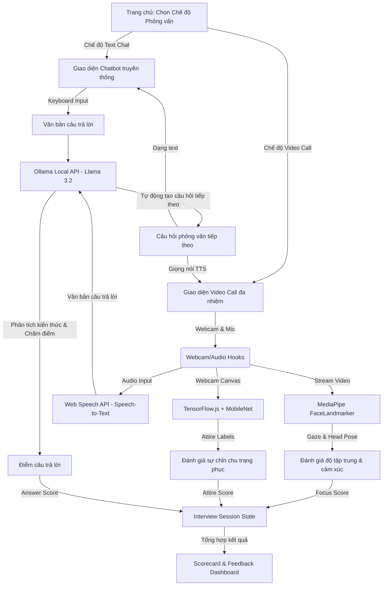

# Kế Hoạch Triển Khai: Hệ Thống Đánh Giá Phỏng Vấn Thông Minh Đa Chế Độ (AI Mock Interviewer & Proctoring System)

Dự án này là một ứng dụng độc lập hoàn toàn mới (AI Mock Interviewer & Proctoring System). Hệ thống đóng vai trò là một người phỏng vấn AI (AI Interviewer) thực hiện tương tác với ứng viên qua hai chế độ linh hoạt, đồng thời tự động đánh giá năng lực toàn diện của ứng viên.

---

## 🎥 Chế Độ Phỏng Vấn Kép (Dual Interview Modes)

Để tạo sự thoải mái và phù hợp với nhiều đối tượng ứng viên, hệ thống hỗ trợ 2 chế độ phỏng vấn từ màn hình cấu hình ban đầu:

### Chế độ 1: 🎥 Video Call (Phỏng vấn Trực quan toàn diện)
* **Đối tượng:** Dành cho người muốn luyện tập phỏng vấn như thật.
* **Cách hoạt động:** Bật Webcam và Micro. Ứng viên nghe câu hỏi từ AI và trả lời bằng giọng nói.
* **Tính năng đi kèm:**
  * Giám sát hướng mắt (Gaze Tracking) & góc lệch đầu (Head Pose) bằng MediaPipe.
  * Phân tích biểu cảm nét mặt (Sự tự tin/Căng thẳng).
  * Chụp snapshot phân tích trang phục văn phòng (Attire check) qua TensorFlow.js.
  * Chuyển giọng nói thành văn bản (Speech-to-Text).

### Chế độ 2: 💬 Text Chat (Phỏng vấn dạng Nhắn tin Chatbot)
* **Đối tượng:** Dành cho ứng viên ngại bật camera, môi trường xung quanh ồn ào, hoặc muốn luyện tập nhanh bằng cách gõ phím.
* **Cách hoạt động:** Tắt hoàn toàn Camera và Micro. AI gửi câu hỏi dưới dạng văn bản và ứng viên gõ câu trả lời vào ô chat.
* **Tính năng đi kèm:**
  * Bỏ qua tất cả các mô-đun giám sát hình ảnh/âm thanh để đảm bảo sự riêng tư tuyệt đối.
  * Tập trung 100% vào việc phân tích nội dung text, ngữ pháp, độ sâu chuyên môn và tốc độ phản hồi.

---

## 🧠 Giải Pháp Công Nghệ Offline & Local (Không Dùng API Đám Mây)

Hệ thống hoạt động 100% cục bộ, không mất phí vận hành và bảo mật dữ liệu tuyệt đối:

1. **Đánh giá Trang phục bằng TensorFlow.js (Client-side):**
   * Sử dụng mô hình **MobileNet v2** chạy trực tiếp trong trình duyệt để phân loại trang phục của ứng viên qua snapshot webcam (phát hiện `suit` - vest, `necktie` - cà vạt, `t-shirt` - áo thun, `pajamas` - đồ ngủ...).
2. **Đánh giá & Sinh câu hỏi bằng Ollama Local:**
   * Kết nối Next.js API Routes tới dịch vụ **Ollama** cục bộ (`http://localhost:11434`).
   * Sử dụng các mô hình nhỏ thông minh như `llama3.2:3b` hoặc `qwen2.5:3b` để phân tích câu trả lời, sinh câu hỏi mới và xuất ra kết quả chấm điểm dạng JSON.
3. **Đàm thoại & Nhận diện Giọng nói:**
   * **Web Speech API** (SpeechRecognition) để dịch câu trả lời giọng nói sang text (STT).
   * **Web Speech Synthesis** để AI đọc câu hỏi thành tiếng (TTS).

---

## 🌟 Các Tính Năng Thông Minh Nâng Cao (Smart Features)

* **AI Avatar Lip-Sync & Biểu cảm (Chỉ có ở chế độ Video Call):**
  * Avatar vector/canvas của AI interviewer sẽ tự nhấp nháy mắt và mấp máy môi đồng bộ với giọng nói của AI (Lip-sync qua Web Audio API).
  * Thay đổi biểu cảm của AI (mỉm cười khích lệ khi ứng viên trả lời tốt, suy tư khi đang phân tích).
* **Hỏi xoáy đáp xoay (Dynamic Follow-up Questions):**
  * Thay vì bộ câu hỏi tĩnh, Ollama sẽ đọc câu trả lời vừa rồi của ứng viên để tự động đặt ra một câu hỏi phụ đào sâu chi tiết (ví dụ: ứng viên nhắc đến *Redis*, AI sẽ hỏi thêm về cách *Invalidate cache*).
* **Làm mờ nền webcam (Client-side Background Blur):**
  * Sử dụng MediaPipe Selfie Segmenter làm mờ hậu cảnh camera của ứng viên để tăng sự tự tin và chuyên nghiệp.

---

## Kiến Trúc Tổng Quan & Luồng Dữ Liệu (Mô hình Local)

---

## 🛠️ Lý Do Phương Pháp Này Hiệu Quả & Chấm Điểm Đúng Đắn

### 1. Tại sao AI sinh câu hỏi tốt và bám sát thực tế?
* **Khác biệt so với ngân hàng câu hỏi tĩnh:** Phỏng vấn truyền thống thường hỏi theo kịch bản có sẵn. Phương pháp "Hỏi xoáy đáp xoay" (Dynamic Follow-up) sử dụng **Ollama (Llama 3.2 / Qwen 2.5)** để đọc hiểu câu trả lời trước đó của ứng viên. AI sẽ phát hiện các từ khóa kỹ thuật (như một dự án cụ thể, một công nghệ cụ thể) và đào sâu vào đó để kiểm tra xem ứng viên có thực sự làm dự án đó hay chỉ ghi vào CV để làm đẹp.
* **Cá nhân hóa theo CV:** Hệ thống cho phép ứng viên upload CV trước khi bắt đầu. Ollama sẽ phân tích các kỹ năng ghi trong CV để tạo ra bộ câu hỏi cá nhân hóa, bám sát kinh nghiệm thực tế của ứng viên.

### 2. Tại sao đánh giá đúng hành vi và tác phong ứng viên?
* **MediaPipe FaceMesh (Chính xác cao):** Sử dụng các điểm mốc hình học 3D trên mặt. Bằng cách đo tỉ lệ khoảng cách giữa mũi và hai tai, hệ thống tính toán góc lệch đầu (Yaw, Pitch, Roll) một cách khoa học. Đồng thời đo khoảng cách giữa mí mắt trên và dưới để tính toán nháy mắt/nhắm mắt. Đây là thuật toán hình học thuần túy, tính toán tức thì, không phụ thuộc vào cảm quan chủ quan.
* **Đánh giá trang phục bằng Học máy phân loại:** Sử dụng **MobileNet** đã được train trên hàng triệu hình ảnh để nhận diện cấu trúc quần áo (áo sơ mi có cổ, cà vạt, áo com-lê...) so với đồ ngủ/áo thun không cổ. Điểm số trang phục được quyết định bằng xác suất dự đoán của mô hình ML, mang tính khách quan cao.

---

## 🔒 Đánh Giá Độ Tin Cậy Của Dự Án (Reliability Assessment)

### 1. Điểm mạnh về độ ổn định
* **Bảo mật tuyệt đối & Không phụ thuộc Cloud:** Do mọi dữ liệu hình ảnh (MediaPipe, TensorFlow.js) và dữ liệu giọng nói/văn bản (Ollama local) được xử lý ngay tại máy Client và máy chủ local, dự án không gặp rủi ro rò rỉ dữ liệu ứng viên. Đồng thời, hệ thống không sợ bị lỗi do mất mạng internet hay vượt quá giới hạn API Rate Limit của nhà cung cấp Cloud.
* **Xử lý thời gian thực mượt mà:** MediaPipe FaceLandmarker chạy trực tiếp trên GPU thông qua WebGL/WebGPU ở trình duyệt, đạt tốc độ 30+ khung hình/giây (fps) mà không gây giật lag giao diện.

### 2. Hạn chế & Giải pháp giảm thiểu (Limitations & Mitigations)
* **Chất lượng Camera & Ánh sáng:** Phòng quá tối hoặc camera mờ có thể làm giảm độ chính xác của MediaPipe và TensorFlow.js.
  * *Giải pháp:* Thiết lập bước **"Pre-flight check"** bắt buộc trước khi phỏng vấn. Ứng viên phải căn chỉnh khung hình, độ sáng đạt chuẩn (hệ thống báo xanh) thì mới được bấm nút bắt đầu.
* **Cấu hình máy chạy Ollama:** Do chạy LLM local, tốc độ sinh câu hỏi phụ thuộc vào CPU/GPU của máy chạy.
  * *Giải pháp:* Tối ưu hóa prompt của Ollama và đề xuất sử dụng mô hình Quantized (ví dụ: `qwen2.5:3b-instruct-q4_K_M`) rất nhẹ, chạy mượt mà ngay cả trên các laptop văn phòng thông thường.

---

## 📦 Tài Nguyên Dự Án (Resources & Models Used)

Dưới đây là các tài nguyên và mô hình được tích hợp trực tiếp vào dự án:

| Thành phần | Thư viện / Công nghệ | Mô hình / API Sử dụng | Kích thước / Chi phí |
| :--- | :--- | :--- | :--- |
| **Giao diện & Logic** | Next.js 16, React 19, TypeScript | N/A | Miễn phí |
| **Nhận diện Khuôn mặt** | `@mediapipe/tasks-vision` | `face_landmarker.task` | ~5.6 MB (Chạy Client) |
| **Nhận diện Trang phục** | `@tensorflow/tfjs` | `MobileNet v2` | ~13 MB (Chạy Client) |
| **Nhận diện Giọng nói (STT)**| Web Speech API (Browser built-in) | Engine của Chrome/Edge | Miễn phí |
| **Đọc câu hỏi (TTS)** | Web Speech API (Browser built-in) | SpeechSynthesisUtterance | Miễn phí |
| **Bộ não AI (LLM)** | Ollama (Local Server) | `qwen2.5:3b-instruct` hoặc `llama3.2:3b` | ~2.0 GB (Chạy Local) |

---

## 📅 Kế Hoạch Thực Hiện Chi Tiết (Project Execution Plan)

Kế hoạch thực hiện dự án được chia làm **3 giai đoạn chính** để tối ưu hóa việc phát triển và kiểm thử:

### Giai đoạn 1: Thiết lập Kiến trúc & Giao diện Chatbot (Tuần 1)
* **Mục tiêu:** Hoàn thành khung xương dự án Next.js độc lập và chế độ phỏng vấn dạng Text Chat (Offline).
* **Công việc:**
  1. Khởi tạo dự án Next.js trong thư mục `ai-mock-interviewer`.
  2. Setup API Route `/api/interview/...` kết nối đến cổng `11434` của Ollama Local.
  3. Thiết kế giao diện Home (Chọn vai trò, chọn CV, chọn Chế độ phỏng vấn).
  4. Xây dựng màn hình Text Chat phỏng vấn với bong bóng chat và kết nối Ollama để chấm điểm/sinh câu hỏi động.

### Giai đoạn 2: Phát triển Chế độ Video Call & Xử lý Hình ảnh Real-time (Tuần 2)
* **Mục tiêu:** Tích hợp camera, đo độ tập trung và nhận diện trang phục.
* **Công việc:**
  1. Xây dựng giao diện Video Call (chia đôi màn hình: AI Avatar và Webcam ứng viên).
  2. Tích hợp MediaPipe FaceLandmarker để tính toán hướng mắt & góc lệch đầu ở Client.
  3. Cài đặt Web Speech API để tự động chuyển giọng nói thành văn bản khi trả lời.
  4. Viết hàm tự động chụp ảnh canvas webcam mỗi 20 giây và đưa qua mô hình TensorFlow.js MobileNet để chấm điểm trang phục.

### Giai đoạn 3: Hoàn thiện Dashboard & Tối ưu hóa Trải nghiệm (Tuần 3)
* **Mục tiêu:** Tạo trang kết quả scorecard trực quan và tối ưu hóa hiệu năng.
* **Công việc:**
  1. Thiết kế trang Dashboard kết quả cuối cùng (vẽ biểu đồ radar, hiển thị lịch sử câu trả lời, nhận xét chi tiết của AI).
  2. Tối ưu hóa UI/UX: thêm hiệu ứng động khi AI nói, xử lý ngắt lời (Interruption).
  3. Thực hiện bước Pre-flight check để kiểm tra thiết bị và ánh sáng trước phỏng vấn.
  4. Viết tài liệu hướng dẫn cài đặt Ollama local và chạy dự án.
